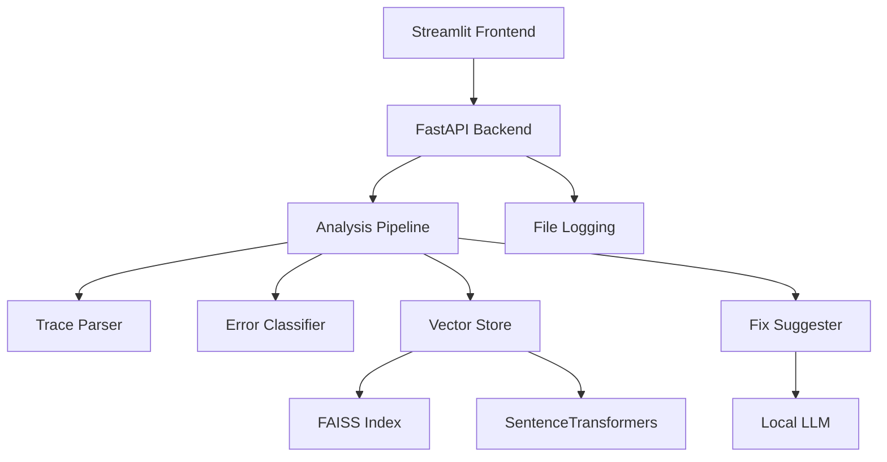

# 🔍 Python Stack Trace Analyzer

> **An AI-powered tool that analyzes Python errors and provides intelligent fix suggestions. Built for developers who want instant, contextual solutions to debugging challenges.**

## 🎯 **Overview**

A full-stack Python error debugging platform combining machine learning with an intuitive web interface:

- **🤖 AI-Powered Analysis**: Regex-based trace parsing + **SentenceTransformers** embeddings + **Ollama/Mistral** LLM for intelligent fix generation
- **🔍 Vector Search**: **FAISS** index with 384-dimensional embeddings for sub-second similarity matching across error knowledge base  
- **⚡ Async Pipeline**: **FastAPI** backend with concurrent processing of parsing, classification, and fix suggestion
- **🌐 Interactive UI**: **Streamlit** frontend with live validation, tabbed results, and export functionality
- **🚀 Production Ready**: Docker containerization, health monitoring, and rate limiting

## 🏗️ **Architecture**



## 🛠️ **Tech Stack**

- **[FastAPI](https://fastapi.tiangolo.com/)** - Backend API framework
- **[Streamlit](https://streamlit.io/)** - Interactive web frontend
- **[FAISS](https://faiss.ai/)** - Vector similarity search engine
- **[SentenceTransformers](https://www.sbert.net/)** - Text embedding models
- **[Ollama](https://ollama.ai/)** - Local LLM deployment (Mistral model)
- **[LangChain](https://langchain.com/)** - LLM application framework

## 🚀 **Quick Start**

### **Run with Docker**
```bash
# Clone the repo
git clone https://github.com/ikemal12/stacktrace-analyzer.git
cd stacktrace-analyzer

# Build and start the app
docker build -t stacktrace-analyzer .
docker run -p 8080:8080 stacktrace-analyzer
```

## 📊 **Usage**

1. Open the web application
2. Paste your Python stack trace into the input area
3. Click "Analyze Trace"
4. Explore your results across organized tabs:
   - **Error Analysis**: Error type and message breakdown
   - **Fix Suggestions**: AI-generated solutions with code examples
   - **Parsed Trace**: Detailed frame-by-frame analysis
   - **Related Errors**: Similar cases from the knowledge base

##  **License**

This project is licensed under the MIT License - see the [LICENSE](LICENSE) file for details.
